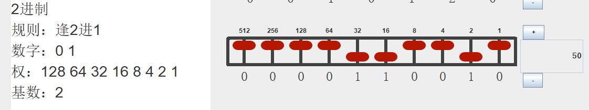
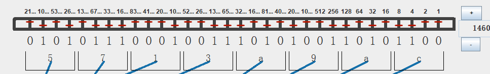
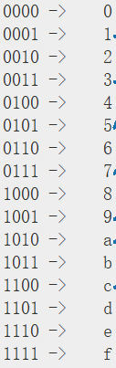
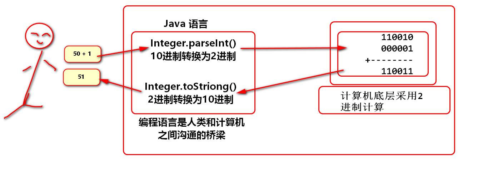
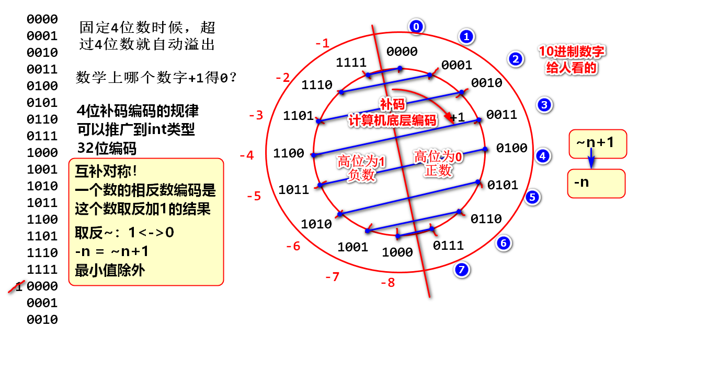
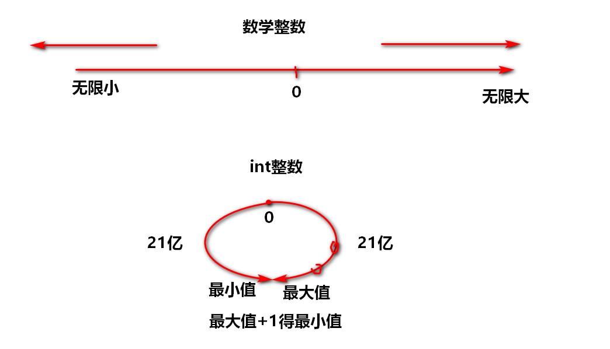

# 二进制

## 什么是2进制

逢2进1的计数规则



Java 中 Integer.toBinaryString(i) 方法输出时候自动省略高位的0

如何将2进制转换为10进制： 将每个1对应的权值求和得出10进制值

```
//int 类型是32位数： 32位2进制
00000000 00000000 00000000 00000000 = 0
00000000 00000000 00000000 00000001 = 1
00000000 00000000 00000000 00000010 = 2
00000000 00000000 00000000 00000011 = 2+1 = 3
00000000 00000000 00000000 00000100 = 4
00000000 00000000 00000000 00000101 = 4+1 = 5
00000000 00000000 00000000 00000110 = 4+2 = 6
00000000 00000000 00000000 00000111 = 4+2+1 = 7
00000000 00000000 00000000 00001000 = 8
00000000 00000000 00000000 00001001
...
00000000 00000000 00000000 00010110 = 16+4+2=22
00000000 00000000 00000000 00010111
00000000 00000000 00000000 00011000
00000000 00000000 00000000 00011001
00000000 00000000 00000000 00011010 = 16+8+2=26 
```

输出0~200的2进制数：

```java
/**
 * 输出0~200的2进制
 */
for(int i=0; i<=200; i++){
    System.out.println(Integer.toBinaryString(i));
}
```

从输出结果中随机抽取20个2进制数，补齐32位，手工计算其10进制值，利用程序验算结果。

例子：

```
00000000 00000000 00000000 00011010 = 16+8+2=26 
```

## 16进制

计算机底层只有2进制， int long double ... 一切数据都是2进制

（double float 是浮点数编码，采用了IEEE-754标准，今天不讨论！）

16进制：

1. 逢16进1的计数规则
2. 计算机行业采用16进制作为2进制的缩写！

16进制作为2进制的缩写？

1. 2进制书写繁琐冗长！
2. 由于16进制的基数是2进制的4次幂，2进制从最低位开始，每4位可以对应转换（缩写）为1位16进制。
3. Java 中16进制的前缀是 0x 

可以将2进制数：

1010111000100111010100110101100(2) 缩写位 5713a9ac(16)

```
int num = 0x5713a9ac;
```




​            101     0111      0001    0011     1010     1001      1010     1100

案例：

```java
int n = 0b01011101_00011100_01111110_10010101;
   //        5   d    1   c    7   e    9   5
System.out.println(Integer.toBinaryString(n));
int m = 0x5d1c7e95;
System.out.println(Integer.toBinaryString(m));
```

练习： 请自行写5个2进制数（32位左右）缩写为16进制，编程验证缩写结果。



计算机处理10进制的原理：



## 补码

引子：

```java
public class Demo03 {
    public static void main(String[] args) {
        int n = -3;
        System.out.println(Integer.toBinaryString(n));
    }
}
```

如上代码输出的是 负数 -3 的2进制编码，编码规则称为“补码”:

```
11111111111111111111111111111101
```

补码：计算机中用于处理负数的一种编码规则， 其编码思路是将固定位数的2进制数分一半作为负数使用。 高位为1的是负数，高位为0的是正数， 最高位称为符号位。

固定位数：

- 采用固定长度的2进制数表示数字，如:int类型就是固定32位长度的
- 计算时候，任何计算结果如果超过固定位数，就自动舍弃多出的位！

> 由于int类型和long位数比较长，这里采用固定4位数为例子，研究负数的编码。 

采用4位2进制研究如何进行补码编码， 然后在推广到32位int类型的编码.

4位2进制只有16个编码，分一半作为负数，负数编码8个， 正数编码8个。




int类型32位2进制，有42亿多个编码，分一半作为负数，负数编码21亿多，正数编码21亿多。



输出负数的编码：

```java
for(int i=-200; i<0; i++){
    System.out.println(Integer.toBinaryString(i));
}
```

负数的编码：输出负数-200~-1的编码，挑选其中20个数，手工计算其值，利用程序验算。

```
11111111 11111111 11111111 11111111 = -1
11111111 11111111 11111111 11111101 = -1-2 = -3
11111111 11111111 11111111 11111001 = -1-2-4 = -7
...
11111111 11111111 11111111 11010001 = -1-2-4-8-32 = -47
...
11111111 11111111 11111111 10011111 = -1-32-64 = -97
```

补码的互补对称：

```java
public static void main(String[] args) {
    /**
     * 验证补码互补对称现象
     * -n = ~n+1
     */
    int n = -8;
    int m = ~n + 1;
    System.out.println(n);
    System.out.println(m);
    //运算原理
    System.out.println(Integer.toBinaryString(n));
    System.out.println(Integer.toBinaryString(~n));
    System.out.println(Integer.toBinaryString(~n+1));
}
```

结果分析：

```
11111111111111111111111111111000 = -1-1-2-4 = -8
00000000000000000000000000000111 = 1+2+4 = 7
00000000000000000000000000001000 = 8
```

很多大学课程，讲解补码：

1. 正数的编码叫原码，就是正数2进制编码
2. 负数编码是：原码取反得到反码，在加一得到负数的编码

实际上，上述描述是将 互补对称公式作为快速计算负数编码的公式了！

问题如下：

1. 没有说明补码是有范围的数
2. 没有说明负数也满足 互补对称公式
3. 更没有说明，负数最小值不能使用这个算法

经典面试题目：

```
System.out.println(~100+1);
A.-98 B.-99 C.-100 D.-101
如上代码输出结果是(  C  )
```

```
System.out.println(~-100+1);
A.98 B.99 C.100 D.101
如上代码输出结果是(  C  )
```

```
System.out.println(~100);
A.-98 B.-99 C.-100 D.-101
如上代码输出结果是(  D  )
```

```
System.out.println(~-100);
A.98 B.99 C.100 D.101
如上代码输出结果是(  B  )
```

## 2进制运算符

运算符： 

```
& 与运算
| 或运算
~ 取反运算
>>> 逻辑右移位运算
>> 数学右移位运算
<< 左移位运算
```

### `&` 与运算

基本规则：逻辑乘法, 有0则0

```
0 & 0 -> 0
0 & 1 -> 0
1 & 0 -> 0
1 & 1 -> 1
```

运算时候需要将两个2进制数对齐位数进行与运算：

举个例子：

```
         6   e    1   8    8   f    d      5 
n =      01101110 00011000 10001111 11010101 
                                    f   f 
m =      00000000 00000000 00000000 11111111
k = n&m  00000000 00000000 00000000 11010101 
```

如上案例的意义：将n的最后8位数截取下来，存储到了k中。也就是数字n的最后8位数（一个字节）存储到了变量k中。显然关键是m这个数字，m有一个名字“Mask（面具）”，这个面具被翻译成“掩码”.

代码：

```java
int n = 0x6e188fd5;
int m = 0xff;
int k = n & m;
//按照2进制输出 n m k 
```

如上运算被称为“掩码运算”，其中按照掩码中的1的个数称为n位掩码，如：

- 8位掩码：00000000 00000000 00000000 11111111 
- 6位掩码：00000000 00000000 00000000 00111111 
- 4位掩码：00000000 00000000 00000000 00001111
- 16位掩码：00000000 00000000 11111111 11111111

- ... 

### `>>>` 逻辑右移位运算

运算规则： 将数字的整体向右移动，低位自动溢出， 高位补0

举个例子：

```
           7   7    c   2    7   0    b   d   
n=         01110111 11000010 01110000 10111101
m=n>>>1    001110111 11000010 01110000 1011110
k=n>>>2    0001110111 11000010 01110000 101111
g=n>>>8    00000000 01110111 11000010 01110000
b3 = (n>>>8) & 0xff;
```

代码：

```java
int n = 0x77c270bd;
int m = n>>>1;
int k = n>>>2;
int g = n>>>8;
int b3 = (n>>>8) & 0xff;
```

## 将一个整数拆分为4个字节

为何要将一个整数拆分为4个字节? 网络只能按照字节为单位传送数据，而int等数据，长度32位都超过了一个字节，在传送int数据时候，需要将int拆分为4个字节数据，进行传送，接收方在收到字节数据以后再组合为int数据，这样就可以完成int数据的传送。

```
如果要发送一个int数据
        b1       b2       b3       b4
n =  01110111 11000010 01110000 10111101
传送前拆分：b1 b2 b3 b4
b1 = 01110111 
b2 = 11000010
b3 = 01110000
b4 = 10111101
在网络上传送：b1 b2 b3 b4 
...

接收方：收到 b1 b2 b3 b4 
b1 = 01110111 
b2 = 11000010
b3 = 01110000
b4 = 10111101
将数据拼接：  b1 b2 b3 b4 -> int
        b1       b2       b3       b4
n =  01110111 11000010 01110000 10111101

```

将整数n拆分为4个字节：

```
         b1       b2       b3       b4
n   = 01110111 11000010 01110000 10111101
b1  = (n>>>24) & 0xff;
b2  = (n>>>16) & 0xff;
b3  = (n>>>8) & 0xff; 
b4  = n & 0xff; //将最后一个字节 b4 拆分出来
```

代码：

```java
int n = 0x77c270bd;
int b1 = (n>>>24) & 0xff;
int b2 = (n>>>16) & 0xff;
int b3 = (n>>>8) & 0xff;
int b4 = n & 0xff;
```

## 将4个字节数据拼接为一个整数

如：

```  
b1 = 00000000 00000000 00000000 10111011
b2 = 00000000 00000000 00000000 10001101
b3 = 00000000 00000000 00000000 11101111
b4 = 00000000 00000000 00000000 10001111
合并为int
        b1       b2       b3      b4
n  = 10111011 10001101 11101111 10001111 
```

//一会给结果...

### 或运算 `|`

基本规则： 逻辑加法, 有1得1

```
0 | 0 = 0
0 | 1 = 1
1 | 0 = 1
1 | 1 = 1
```

运算时候将两个2进制数对齐位数，对应数字进行或运算

举个栗子：

```
n =    00000000 00000000 00000000 10111011
m =    00000000 00000000 10111111 00000000
k =n|m 00000000 00000000 10111111 10111011 
```

如上运算的意义：n和m进行了错位拼接！

代码：

```java
int n = 0xbb;
int m = 0xbf;
int k = n|m;
//输出n m k 
```

### `<<` 左移位运算

运算规则：将2进制数字整体向左移动，高位自动溢出，低位补0

栗子：

```
           b   e    d   e    3   7   1   a
n  =       10111110 11011110 00110111 00011010
m = n<<1   0111110 11011110 00110111 000110100
k = n<<2   111110 11011110 00110111 0001101000
g = n<<8   11011110 00110111 00011010 00000000  //向左错位
```

代码：

```java
int n = 0xbede371a;
int m = n<<1;
int k = n<<2;
int g = n<<8;
//按照2进制输出检查n m k g 的结果
```


